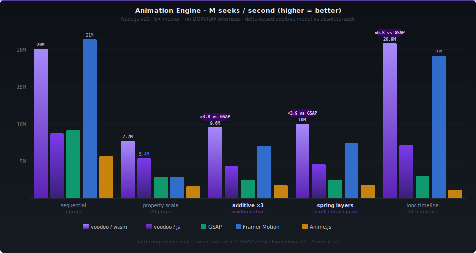

<h1 align="center">react-voodoo</h1>
<p align="center"><b>Additive · Swipeable · SSR-ready · Physics-based</b><br/>A delta-driven tween composition engine for React</p>

<p align="center"></p>

<p align="center">
<a href="https://www.npmjs.com/package/react-voodoo"></a>
<a href="https://travis-ci.org/react-voodoo/react-voodoo"></a>

<br/>
<a href="https://www.apache.org/licenses/LICENSE-2.0"></a>
</p>

<p align="center">
  <a href="doc/readme.md"><b>Full documentation</b></a> &nbsp;·&nbsp;
  <a href="https://react-voodoo.github.io/react-voodoo-samples/"><b>Live demos & CodeSandbox</b></a> &nbsp;·&nbsp;
  <a href="https://github.com/react-voodoo/react-voodoo-samples"><b>Sample sources</b></a>
</p>

<p align="center"></p>

---

## Why react-voodoo?

Most animation libraries output **absolute values** — they own a CSS property and write a number to it each frame. That works fine for isolated transitions, but breaks down the moment you need to combine sources: a scroll position driving `translateY`, a drag gesture adding to the same `translateY`, and a parallax offset stacking on top. The libraries fight each other and you end up writing glue code.

React-voodoo takes a different approach: its engine computes **deltas** — the *change* from the previous frame — and accumulates them additively across any number of axes. Multiple animations on the same property simply add together. No ownership, no conflicts.

The engine is built on [tween-axis](../tween-axis/README.md) and uses its WebAssembly backend for hot-path property accumulation with zero JS-boundary crossings per frame.

This unlocks a set of features that are unique to the delta model:

| Feature | How |
|---|---|
| **Additive multi-axis composition** | Each axis contributes a delta; they stack without coordination code. |
| **Swipeable / draggable animations** | Drag gestures are mapped directly to axis positions with realistic momentum. |
| **Predictive inertia** | The engine computes the final snap target *at the moment of release*, before the animation plays out — useful for preloading the next slide. |
| **Physical spring settle** | `settle: { stiffness, damping, mass }` — the landing curve is generated at release from the actual gesture velocity (closed-form, no per-frame integration), with per-waypoint overrides. |
| **Reduced-motion aware** | `reducedMotion: "user"` honors the OS *prefers-reduced-motion* setting: transitions jump to their predicted target, callbacks still fire, 1:1 dragging untouched. |
| **SSR with correct initial styles** | Axes have a `defaultPosition`; styles are computed server-side and rendered inline — no flash on first paint. |
| **DOM writes bypass React** | Style updates go straight to `node.style` via direct DOM writes, never triggering a re-render. |
| **Multi-unit CSS via `calc()`** | Mix `%`, `px`, `vw`, `bw`/`bh` (box-relative units) in a single value — compiled to `calc()` automatically. |

---

## Comparison

### Feature matrix

| | **react-voodoo** | Framer Motion v12 | GSAP + ScrollTrigger | react-spring v10 | Motion v5 | anime.js v4 |
|---|:---:|:---:|:---:|:---:|:---:|:---:|
| Scroll-linked animation | ✅ | ✅ `useScroll` | ✅ | ⚠️ manual | ✅ | ✅ `ScrollObserver` |
| Drag-linked animation | ✅ native | ✅ `drag` | ⚠️ manual | ✅ `@use-gesture` | ✅ gestures | ✅ `Draggable` |
| **Additive multi-axis composition** | ✅ | ❌ | ❌ | ❌ | ❌ | ❌ |
| Physics / momentum inertia | ✅ predictive + springs | ✅ spring | ❌ | ✅ spring | ⚠️ limited | ✅ spring |
| Reduced-motion (a11y) | ✅ built-in | ✅ built-in | ⚠️ manual | ✅ built-in | ✅ built-in | ⚠️ manual |
| **Predictive snap target** | ✅ | ❌ | ❌ | ❌ | ❌ | ❌ |
| **SSR — correct initial styles** | ✅ | ⚠️ flash | ⚠️ flash | ⚠️ flash | ⚠️ flash | ❌ |
| Bypasses React render loop | ✅ | ✅ | ✅ | ✅ | ✅ | ✅ |
| Transform layer composition | ✅ | ❌ | ❌ | ❌ | ❌ | ❌ |
| SVG geometry attributes | ✅ | ✅ | ✅ | ❌ | ✅ | ✅ |
| Multitouch (drag multiple axes) | ✅ | ❌ | ❌ | ❌ | ❌ | ❌ |
| Bundle size (approx. gzip) | ~18 kB | ~32 kB | ~35 kB | ~25 kB | ~4 kB | ~10 kB |
| React dependency | 16 – 19 | ≥ 18 | none | ≥ 16 | none | none |

---

## Performance

The delta model isn't just an architectural choice — the numbers back it up.
In the scenarios that define react-voodoo's use-case — **compositing multiple animation
sources on the same element** — the engine runs **3–7× faster than GSAP** and handles
far more properties per frame without degrading.

<p align="center">
  
</p>

<details>
<summary><b>What each scenario measures</b></summary>

| Scenario | Description |
|---|---|
| **sequential · 5 props** | Frame-by-frame advance, 5 CSS properties — the baseline everyone tests |
| **property scale · 20 props** | Same advance with 20 properties — reveals engine scaling cost per property |
| **additive ×3** | Three independent animation axes all writing to the same 5 properties simultaneously. This is react-voodoo's **native model**. Competitors must run 3 separate timelines and manually sum results. |
| **spring layers** | Same 3 axes at different speeds (×1, ×0.7, ×0.3) — the signature scroll + drag + push composition pattern react-voodoo is built for |
| **long timeline · 20 segs** | A timeline with 20 sequential animation segments — models a full-page scroll sequence or complex keyframe chain |

</details>

<details>
<summary><b>Why voodoo wins at scale</b></summary>

- **Compiled-per-property processors** — at mount time each tween compiles a dedicated function (via `new Function`) that contains only the branches it needs. There is no per-property dispatch loop at runtime; property count scales at near O(1).
- **WASM state machine** — the marker-scan loop (the part that decides which tweens are active as the cursor moves) runs entirely in WebAssembly. Zero JS-boundary crossings per frame in the hot path.
- **Additive is free** — `goTo(pos, scope)` accumulates deltas into the same plain object regardless of how many axes call it. Competitors must maintain N separate target objects and merge them manually.

The one scenario where a stateless interpolator (Framer Motion / Popmotion) wins is
a **single small axis with easing**: pure math functions with no timeline state beat even
WASM for trivially short timelines. That overhead is the fair cost of additive composability —
and it disappears entirely once you have more than one axis compositing on the same element.

</details>

> Full benchmark source: [`perf-compare/bench.js`](../perf-compare/bench.js)
> Detailed analysis: [`doc/Alternatives libs perf comparaison.md`](doc/Alternatives%20libs%20perf%20comparaison.md)

---

## Installation

```bash
npm install react-voodoo
```

**Peer dependencies:** `react` & `react-dom` 16 – 19

---

## All-in-one example

Every major feature in a single component, with comments explaining each part.

```jsx harmony
import React                                  from "react";
import Voodoo                                 from "react-voodoo";
import {itemTweenAxis, tweenArrayWithTargets} from "./somewhere";

const styleSample = {
	/**
	 * Voodoo.Node style property and the tween descriptors use classic CSS-in-JS declaration
	 * exept we can specify values using the "box" unit which is a [0-1] ratio of the parent ViewBox height / width
	 */

	height: "50%",

	// the tweener deal with multiple units
	// it will use css calc fn to add them if there's more than 1 unit used
	width: ["50%", "10vw", "-50px", ".2box"],

	// transform can use multiple "layers"
	transform: [
		{
			// use rotate(X|Y|Z) & translate(X|Y|Z)
			rotateX: "25deg"
		},
		{
			translateZ: "-.2box"
		}
	],

	filter:
		{
			blur: "5px"
		}
};
const axisSample  = [// Examples of tween descriptors
	{
		target  : "someTweenRefId",   // target Voodoo.Node id ( optional if used as parameter on a Voodoo.Node as it will target it )
		from    : 0,                // tween start position
		duration: 100,              // tween duration
		easeFn  : "easeCircleIn",   // function or easing fn id from [d3-ease](https://github.com/d3/d3-ease)

		apply: {// relative css values to be applied
			// Same syntax as the styles
			transform: [{}, {
				translateZ: "-.2box"
			}]
		}
	},
	{
		from    : 40,
		duration: 20,

		// triggered when axis has scrolled in the Event period
		// delta : a float value between [-1,1] is the update inside the Event period
		entering: ( delta ) => false,

		// triggered when axis has scrolled in the Event period
		// newPos, precPos : float values between [0,1] position inside the Event period
		// delta : a float value between  [-1,1] is the update inside the Event period
		moving: ( newPos, precPos, delta ) => false,

		// triggered when axis has scrolled out the Event period
		// delta : a float value between  [-1,1] is the update inside the Event period
		leaving: ( delta ) => false
	}
];

const Sample = ( {} ) => {

	/**
	 * Voodoo tweener instanciation
	 */
		// Classic minimal method
	const [tweener, ViewBox]                   = Voodoo.hook();
	// get the first tweener in parents
	const [parentTweener]                      = Voodoo.hook(true);
	// Create a tweener with options
	const [twenerWithNameAndOptions, ViewBox2] = Voodoo.hook(
		{
			// Give an id to this tweener so we can access it's axes in the childs components
			name: "root",
			// max click tm in ms before a click become a drag
			maxClickTm: 200,
			// max drag offset in px before a click become a drag
			maxClickOffset: 100,
			// lock to only 1 drag direction
			dragDirectionLock: false,
			// allow dragging with mouse
			enableMouseDrag: false,
			// honor the OS prefers-reduced-motion setting : "user" | "always" | "never" (default)
			// when active : eased scrolls & anims jump to their final state, inertia
			// teleports to the predicted snap target ( callbacks still fire )
			reducedMotion: "user"
		}
	);
	// get a named parent tweener
	const [nammedParentTweener]                = Voodoo.hook("root")

	/**
	 * once first render done, axes expose the following values & functions :
	 */
	// Theirs actual position in :
	// tweener.axes.(axisId).scrollPos

	// The "scrollTo" function allowing to manually move the axes positions :
	// tweener.axes.(axisId).scrollTo(targetPos, duration, easeFn)
	// tweener.scrollTo(targetPos, duration, axisId, easeFn)

	// They can also be watched using the "watchAxis" function;
	// When called, the returned function will disable the listener if executed :
	React.useEffect(
		e => tweener?.watchAxis("scrollY", ( pos ) => doSomething()),
		[tweener]
	)

	return <ViewBox className={"container"}>
		<Voodoo.Axis

			id={"scrollY"}          // Tween axis Id
			defaultPosition={100}   // optional initial position ( default : 0 )

			// optional Array of tween descriptors with theirs Voodoo.Node target ids ( see axisSample )
			items={tweenArrayWithTargets}

			// optional size of the scrollable window for drag synchronisation
			scrollableWindow={200}

			// optional length of this scrollable axis (default to last tween desciptor position+duration)
			size={1000}

			// optional bounds ( inertia will target them if target pos is out )
			bounds={{ min: 100, max: 900 }}

			// optional inertia cfg ( false to disable it )
			inertia={
				{
					// called when inertia is updated
					// should return instantaneous move to do if wanted
					shouldLoop: ( currentPos ) => (currentPos > 500 ? -500 : null),

					// called when inertia know where it will end ( when the user stop dragging )
					willEnd: ( targetPos, targetDelta, duration ) => {
					},

					// called when inertia know where it will snap ( when the user stop dragging )
					willSnap: ( currentSnapIndex, targetWayPointObj ) => {
					},

					// called when inertia end
					onStop: ( pos, targetWayPointObj ) => {
					},

					// called when inertia end on a snap
					onSnap: ( snapIndex, targetWayPointObj ) => {
					},

					// settle easing : how the axis travels to the landing position
					// ( default : easePolyOut )
					// - any d3-ease fn name or custom easing fn
					// - or a physical spring : the curve is generated at release from
					//   the actual gesture velocity ( velocity continuity + bounce ),
					//   the predictive waypoint snap stays authoritative
					settle: { stiffness: 200, damping: 14 },

					// list of waypoints ; gravity > 1 makes a waypoint stickier,
					// a per-waypoint settle overrides the axis-level one
					wayPoints: [{ at: 100 }, { at: 200, gravity: 2, settle: "easeCubicOut" }]
				}
			}
		/>

		{/*
		 * Voodoo.Node must have exactly ONE child element.
		 * When you need multiple children, use Voodoo.Node.div — it renders
		 * itself as the <div> container so its children are not Node's direct children.
		 *
		 *   <Voodoo.Node.div id="x" style={…}>
		 *     <span>child 1</span>
		 *     <span>child 2</span>
		 *   </Voodoo.Node.div>
		 */}
		<Voodoo.Node
			id={"testItem"} // optional id

			style={styleSample}// optional styles applied before any style coming from axes : css syntax + voodoo tweener units & transform management

			axes={{ scrollY: axisSample }} // optional Array of tween by axis Id with no target node id required ( it will be ignored )

			onClick={// all unknow props are passed to the child node
				( e ) => {
					// start playing an anim ( prefer scrolling Axes )
					tweener.pushAnim(
						// make all tween target "testItem"
						Voodoo.tools.target(pushIn, "testItem")
					).then(
						( tweenAxis ) => {
							// doSomething next
						}
					);
				}
			}
		>
			<Voodoo.Draggable
				// make drag y move the scrollAnAxis axis
				// xAxis={ "scrollAnAxis" }

				// scale / inverse dispatched delta
				// xHook={(delta)=>modify(delta)}

				// React ref to the box, default to the parent ViewBox
				// scale is as follow : (delta / ((xBoxRef||ViewBox).offsetWidth)) * ( axis.scrollableWindow || axis.duration )
				// xBoxRef={ref}

				yAxis={"scrollY"}// make drag y move the scrollY axis
				// yHook={(delta)=>modify(delta)}
				// yBoxRef={ref}

				// mouseDrag={true} // listen for mouse drag ( default to false )
				// touchDrag={false} // listen for touch drag ( default to true )

				// button={0-2} // limit mouse drag to the specified event.button ( default to 0; the left btn )

				// * actually Draggable create it's own div node
			>
				<div>
					Some content to tween
				</div>
			</Voodoo.Draggable>
		</Voodoo.Node>
	</ViewBox>;
}
```

For a more complete annotated example with inertia callbacks, `watchAxis`, and programmatic scrolling, see the [full documentation](doc/readme.md).

---

## Core concepts in 30 seconds

**Axis** — a virtual number line. Move its position (by drag, scroll, or code) and it drives CSS animations on any number of nodes.

**Node** — a React element whose styles are controlled by one or more axes. Style updates go straight to `node.style`, no re-renders.

**Delta composition** — each axis contributes a *change* per frame. Stack a horizontal drag axis and a parallax axis on the same `translateX` and they simply add together. No ownership, no conflicts.

```
axis position ──► tween engine ──► Δ per property ──► node.style (direct DOM write)
                                         ▲
                              other axes add their Δ here
```

---

## License

React-voodoo is licensed under the **[Apache License 2.0](./LICENSE.MD)** — © Nathanael BRAUN.

---

## Support the project

If react-voodoo saved you a day of work, consider supporting it:

[](#)

**BTC** — `bc1qh43j8jh6dr8v3f675jwqq3nqymtsj8pyq0kh5a`

**PayPal** — <a href="https://www.paypal.com/donate/?hosted_button_id=ECHYGKY3GR7CN"></a>
